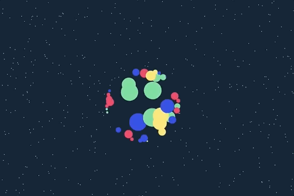

# Pts

   

Pts is a typescript/javascript library for visualization and creative-coding. 

**Option 2:**   
Install via `npm install pts`. Then you can choose to import some parts of Pts into your project as needed. 
```js
import {CanvasSpace, Pt, Group, Line} from 'pts';

### For development

Pts is written in typescript. You can clone or fork this project and build it as follows:

#### Build and test

Clone this repo and install dependencies via `npm install`.

```bash
npm start
npm run build
npm test
```

#### Generate documentations
Run this to generate Pts styled documentations. (Requires python 3.6)
```bash
npm run docs 
```

If you prefer to generate default typedocs, run this:
```bash
typedoc --readme none --out typedocs src --name Pts
```

#### Generate typescript declaration files and minify
```bash
npm run typings
npm run minify
```

---

### Contributing

We appreciate your support and feedbacks!

Please file issues if you find bugs and have feature requests. If you are able to send small PRs to improve Pts or fix bugs, that would be awesome too. 
