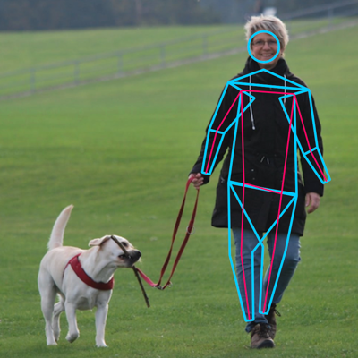
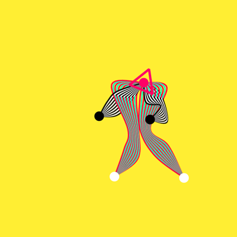

# Visualizing Pose with Pts and tensorflow.js

Demos of using [Pts](https://ptsjs.org) to draw poses estimated by [tensorflow.js](https://js.tensorflow.org/)'s [PoseNet](https://medium.com/tensorflow/real-time-human-pose-estimation-in-the-browser-with-tensorflow-js-7dd0bc881cd5). It includes a `BodyPose` class which helps you manage and visualize the key points. This is still very much in a hacky prototype form, so please enjoy the ride :)

### Demos

- `a.html` is a simple demo that visualize an estimated pose from a static image.   

  

- `b.html` demonstrates how to take a webcam input, get the pose estimation, and draw the pose in an expressive way. Inspired by Matisse's paper cut-outs.

  

- `c.html` is similar to "b" but using a video file. Inspired by Oskar Schlemmer's Triadic Ballet.

  

### Quick Start

#### Preparing input
You can use a video or an image -- square size works best. There's no need to normalize the bitmap data. In `bodypose.js`, there's a `webcam` function to connect to webcam, and a `BodyPose.squareBuffer` function which helps you take a square crop of your input.

#### Data structure
PoseNet returns json data in this structure: 

```
{
  score,
  keypoints: [ { position: { x, y }, score }, ... ]
}
```

You can pass the raw data into `BodyPose.update` function, and then query them by keys. The keys are:   

```
nose, leftEye, rightEye, leftEar, rightEar, leftShoulder, rightShoulder, leftElbow, rightElbow, leftWrist, rightWrist, leftHip, rightHip, leftKnee, rightKnee, leftAnkle, rightAnkle
```

### Drawing
The `BodyPose` class offers a number of convenient functions for visualizing the pose. Let's take a quick look.

First, you can take one or more pose key points like the following. (Here `body` is an instance of a `BodyPose`.)

- `body.at( "leftShoulder" )` : get the current left shoulder point
- `body.take( ["leftShoulder", "leftElbow", "leftWrist"] )` : get an array of 3 key points
- `body.joint( "leftShoulder", 20 )` : get the left shoulder point as a 20px radius circle for drawing.

Similary to `joint`, you can get a part of the body in various thickness. For example:

- `body.body( 40, 10 )` : get a torso with shoulder scale of 40, and hip scale of 10
- `body.arm( "left", 20, 10, 5 )` : get a left arm with shoulder scale of 20, elbow of 10, and wrist of 5

Finally, you can get a wireframe of the whole body with `body.wireframe()`. This returns groups of lines which you can then draw using `form.line(...)` function. 


### And more
The `BodyPose` should be general enough to support drawing poses from other libraries. For example, you can probably run a PyTorch pose model in python, send the raw data through websockets (eg, with SocketIO), and visualize the pose in the browser.

Note that this is a prototype demo for hacking. If you have suggestions, please file an issue or ping @williamngan on twitter.

## Photo / Video credits
- Photo used in "a" demo from CC licensed photo at pexels.com/photo/animal-canine-dog-grass-220968
- Video used in "c" demo from CC licensed video at https://www.youtube.com/watch?v=gADY77Jy2-Q